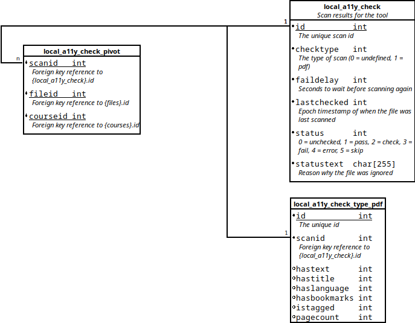

# db schema

## Quick Look

## Tables

### local_a11y_check

This table contains data pertaining to the scan of a file. That is to say, the table holds information about the scan itself, and not the a11y-specific results of it.

**Fields**

* id
* checktype
* faildelay
* lastchecked
* status
* statustext

### local_a11y_check_type_pdf

This table holds information about the a11y results for a specific scan.

**Fields**

* id
* scanid
* hastext
* hastitle
* haslanguage
* hasbookmarks
* istagged
* pagecount

### local_a11y_check_pivot

This table relates a scan to it's file and course.

**Fields**

* scanid
* fileid
* courseid
